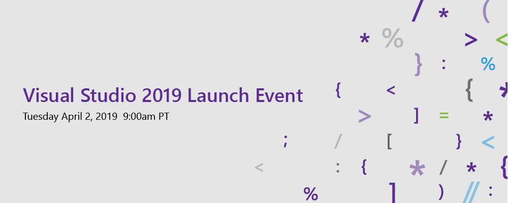
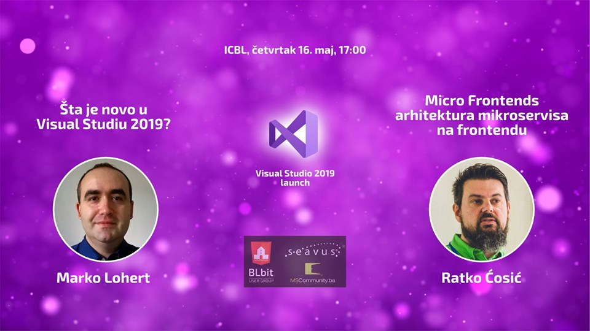

# BLbit novosti
### 16. maj 2019.

---

## Novosti: .NET ekosistem

- [Najavljen .NET 5!](https://devblogs.microsoft.com/dotnet/introducing-net-5/)
  - Budućnost .NET platforme
  - Baziran na .NET Core
  - .NET Core 3.0 - RC u julu, finalna verzija u septembru
  - .NET Core 3.1 - oktobar 2019
  - .NET 5 - novembar 2020
- [Blazor u oficijelnoj preview fazi](https://devblogs.microsoft.com/aspnet/blazor-now-in-official-preview/)
- [Objavljen ML.NET 1.0](https://devblogs.microsoft.com/dotnet/announcing-ml-net-1-0/)

---

## Novosti: Ostalo

- [Visual Studio 2019 GA](https://devblogs.microsoft.com/visualstudio/visual-studio-2019-code-faster-work-smarter-create-the-future/)
- [Remote development i Visual Studio Online](https://devblogs.microsoft.com/visualstudio/intelligent-productivity-and-collaboration-from-anywhere/)
- [Novi Windows Terminal](https://devblogs.microsoft.com/commandline/introducing-windows-terminal/)
- [Najavljen WSL 2](https://devblogs.microsoft.com/commandline/announcing-wsl-2/) - Windows subsystem for Linux, sa Linux kernelom!
- [GitHub Package Registry](https://github.blog/2019-05-10-introducing-github-package-registry/)

---

## Community: Konferencije

- NT konferenca 24, 21-23.05., Portorož Slovenija - https://ntk.si/
- Tarabica 19, 25.05., Beograd Srbija - http://www.tarabica.org/
- Shift Dev, 30-31.05., Split Hrvatska - https://dev.shiftconf.co/
- WeAreDevelopers World Congress 2019, 6-7.06., Berlin Njemačka - https://events.wearedevelopers.com/

---

## Community: Local

- Seavus CodeTalks, 15. maj
- makeITwork - sajam tehnologija, 18. i 19. maj
- Najava: Init Conference - na jesen

---

## Community: BLbit

- Visual Studio 2019 Launch party
- Global Azure Bootcamp
- Visual Studio 2019 Launch meetup

---

## Community: BLbit

- Današnji meetup - Visual Studio 2019 launch - local event

- Naredni meetup - TBD - Mišo Stamenić?
- DevOps Bootcamp - 15. juni???

---

## Današnja predavanja

---

## RevDeBug video

